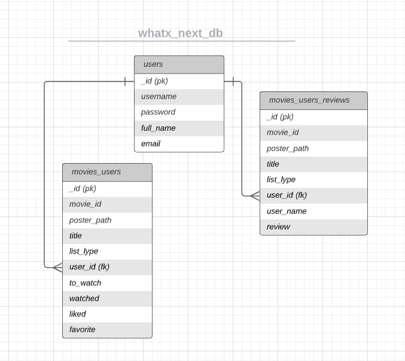

 

---

## Table of Contents
1. [**UX**](#ux)
    - [**User Stories**](#user-stories)
    - [**Design**](#design)
        - [**Framework**](#framework)
        - [**Color Scheme**](#color-scheme)
        - [**Icons**](#icons)
        - [**Typography**](#typography)
    - [**Wireframes**](#wireframes)

2. [**Features**](#features)
    - [**Features Left to Implement**](#features-left-to-implement)

3. [**Technologies Used**](#technologies-used)

4. [**Testing**](#testing)
    - [**Project development walkthrough**](#project-development-walkthrough)
    - [**Validators**](#validators)
    - [**Compatibility**](#compatibility)
    - [**Known Issues**](#known-issues)
    - [**Automated Testing**](#automated-testing)

5. [**Deployment**](#deployment)

6. [**Credits**](#credits)
    - [**Media**](#media)
    - [**Code**](#code)
    - [**Acknowledgements**](#acknowledgements)
    - [**Disclaimer**](#disclaimer)

---

## UX
> ### **Whatx Next?**
> 
 It's My 3º Milestone Project from Code Institute, and it is a web page developed using the Flask Framework, Jquery, Materialize and powered by The Movie DB API, providing all movies and tv series content. 

>
>[Click Here to view the site](https://whatx-next.herokuapp.com/)

##### back to [top](#table-of-contents)

### User Stories

> "**_As a user, I would like to_** _______________"
>
> - View the website on a PC, mobile or tablet.
> - Create my own user account.
> - Enter using my login details.
> - View Trend Lists for movies and Series as Now Playing or Top Rated or Popular.
> - Search for a movie or tv series that I may like and it is not displayed on TMDB provided trend lists.
> - If avaiable look the movie data as: Original Title, Duration, Movie URL, Overview, Genre, etc.
> - Create and edit my Watchlist.
> - Create and edit my Watched list.
> - Create and edit a movie list that I like.
> - Create and edit a list with my favorite movies.
> - Manage my movies list, (delete) from all lists.
> - Add and check reviews from movies.
> - Manage my review at the movie, (delete or edit).
> - Logout.
> - Contact the page owner to request something or get in touch.
> - Delete my user account, excluding all reviews and lists.
> - Discover related movies.
> - Login using my google account.

##### back to [top](#table-of-contents)

### Design
> - The desing is based on the [Parallax](https://materializecss.com/templates/parallax-template/preview.html) template from materialize 

#### Framework
> - Flask Framework
#### Color Scheme
> - The color scheme is based on the [Parallax](https://materializecss.com/templates/parallax-template/preview.html) template from materialize 

#### Icons
> - Icons used were get on [Materialize](https://materializecss.com/icons.html) and [Fontawesome](https://fontawesome.com/)

#### Typography
> - The typography is based on the [Parallax](https://materializecss.com/templates/parallax-template/preview.html) template from materialize 
##### back to [top](#table-of-contents)

### Wireframes
> - The First desing think was this below
>   - View of it on Am I Responsive:
> 

> 

##### back to [top](#table-of-contents)

---

## Features

> All main features to the user needs were implemented, missing a few nice ones but not essentials.
>
> "**_As a user, I would like to_** _______________"
>
> - View the website on a PC, mobile or tablet.
>   - View of it on Am I Responsive:
> 

> 

##### back to [top](#table-of-contents)
---

> - Create my own user account.
>   - Register screen to create your account.
> 

> 

##### back to [top](#table-of-contents)
---

> - Enter using my login details.
>   - Screen to Log in.
> 

> 

##### back to [top](#table-of-contents)
---

> - View Trend Lists for movies and Series as Now Playing or Top Rated or Popular.
>   - Navbar dropdown with the TMDB Lists for movies and tv shows.
> 

> 
> 
> 
> 
> 
> 
> 
> 

##### back to [top](#table-of-contents)
---

> - Search for a movie or tv series that I may like and it is not displayed on TMDB provided trend lists.
>   - Type what you are looking for and press enter
> 

> 
> 

##### back to [top](#table-of-contents)
---

> - If avaiable look the movie data as: Original Title, Duration, Movie URL, Overview, Genre, etc.
>   - Movie/Tv Show screen, and when avaiable the Revenue tab.
> 

> 
> 

##### back to [top](#table-of-contents)
---

> - Create and edit my Watchlist.
>   - Open the movie, select the option below and and click on update lists to save to watchlist.
> 

> 

##### back to [top](#table-of-contents)
---

> - Create and edit my Watched list.
>   - Open the movie, select the option below and and click on update lists to save to watched list.
> 

> 

##### back to [top](#table-of-contents)
---

> - Create and edit a movie list that I like.
>   - Open the movie, select the heart option below and and click on update lists to save it, when clicked at the heart the watched button get checked as well, if you liked means you've watched too.
> 

> 

##### back to [top](#table-of-contents)
---

> - Create and edit a list with my favorite movies.
>   - Open the movie, select the star option below and and click on update lists to save it, when clicked at the star the watched button get checked as well, if it is one favorite movie, means you've watched too.
> 

> 

##### back to [top](#table-of-contents)
---

> - Manage my movies list, (delete) from all lists.
>   - Go to *My Movies tab and, select to delete a movie, or just open and manage some list information about the movie, as shown previously.
>   - To delete a movie from all lists a confirmation will be required.
> 

> 
> 

##### back to [top](#table-of-contents)
---

> - Add and check reviews from movies.
>   - On the movie page, click on review tab, and check for reviews, add some, update or delete your review, if you want it.
> - Manage my review at the movie, (delete or edit).
>   - To edit or submit your comment, just write down on the field what you want and click on submit, and to delete your review click on Delete Review and confirm at modal window as image below.
> 

> 
> 

##### back to [top](#table-of-contents)
---

> - Logout.
>   - Just click at log out option on navbar when logged in. 
> 

> 

##### back to [top](#table-of-contents)
---

> - Contact the page owner to request something or get in touch.
>   - Just click at contact us option on navbar, that scrools the page down until the contact us section, a toast and a flash message confirm that the email were sent, and below an email sample on the developer email inbox.
> 

> 
> 
> 
> 
  

>
> 

##### back to [top](#table-of-contents)
---

> - Edit or delete my user account
>   -  When Logged in click on the user name option on the navbar, that drives you to the edit profile page, there you have the option to change username,
password, full name, email, and delete account (that option excludes all user information), to delete a confirmation is required.
> 

> 
> 
> 

##### back to [top](#table-of-contents)
---

> - Footer and Top Button
>   -  On the left of the footer section is the TMDB Api credit, as requested to use this api engine, on the middle a description of the Whatx Next? project, and on the right side and the bottom of the page, Project and credit links, and for the last, the top button shown always after scrolling the page down.
>
> 

> 

##### back to [top](#table-of-contents)
---

> - Hovering Carousel and movie lists
>   -  When Hovering the carousel movies they get some zoom transition and tooltiped title, and when hovering the movies on lists they get some zoom and full color transition and also tooltiped title.
> 

> 
> 

##### back to [top](#table-of-contents)
---

> - Error 404
>   -  A default page to 404 Not Found Error was add
> 

> 

##### back to [top](#table-of-contents)
---

### Features Left to Implement
> Unfortunetly this features were not implemented yet.
> - Discover related movies.
> - Login using my google account.

##### back to [top](#table-of-contents)

---

## Technologies Used
> This project uses Python with Flask, MongoDb, HTML, CSS and JavaScript.
>
>   [Flask](https://flask.palletsprojects.com/en/2.0.x/)
> - Developer used Python through **Flask** Framework.
>   [MongoDb](https://www.mongodb.com/)
> - Developer used **MongoDb** as database.
> - [Jquery](https://jquery.com/)
>    - Developer used **Jquery** Library that helps to write JavaScript.
> - [Gitpod](https://gitpod.io/)
>    - Developer used **Gitpod** as IDE to build the website.
> - [Materialize](https://materializecss.com/)
>    - The project uses **Materialize** to simplify the development process  and make the website responsive easily.
> - [EmailJS](https://www.emailjs.com/)
>    - The **EmailJS** was used as email service, on the contact us section.
> - [GitHub](https://github.com/)
>    - This project uses **GitHub** to store and share all project code remotely.
> - [Balsamiq](https://balsamiq.com/)
>    - The Wireframes was created using **Balsamiq**.
> - [Coolors](https://coolors.co/)
>    - The **Coolors** was used to define the project color scheme.
> - [W3C HTML Validator](https://validator.w3.org/)
>    - The **W3C HTML Validator** was used to validate the project html.
> - [W3C CSS Validator](https://jigsaw.w3.org/css-validator/)
>    - The **W3C CSS Validator** was used to validate the project css.
> - [JSHINT](https://jshint.com/)
>    - The **JSHINT** was used to verify JavaScript code warning & error check.
> - [Web Page Test](https://www.webpagetest.org/)
>   - The **Web Page Test** was used to verify the website performance.
> - [Lucid Chart](https://lucid.app/lucidchart/)
>   - The **Lucid Chart** was used to draw the Flow ER from the database.

##### back to [top](#table-of-contents)

---

## Testing

> Validating User Stories:
>
> "**_As a user, I would like to_** _______________"
>
> - Create my own user account.
> 	- When Opening the site, on the navbar it is located the register option, on mobile is located at the side-navbar
> - Enter using my login details.
>	- When opening the site, on the navbar it is located the log in option, on mobile is located at the side-navbar
> - View Trend Lists for movies and Series as Now Playing or Top Rated or Popular.
>	- When opening the site, on the navbar it is located the dropdown TMDB Lists where are located all trend lists, on mobile is located at the side-navbar
> - Search for a movie or tv series that I may like and it is not displayed on TMDB provided trend lists.
>	- When opening the site, on all pages the head of the page has the search bar to research whenever wanted.
> - If avaiable look the movie data as: Original Title, Duration, Movie URL, Overview, Genre, etc.
>	- When click and opening a movie or a tv show, all data avaiable about the title will be displayed.
> - Create and edit my Watchlist.
>	- When on the view movie screen, the user is able to add edit remove the title from your lists.
> - Create and edit my Watched list.
>	- When on the view movie screen, the user is able to add edit remove the title from your lists.
> - Create and edit a movie list that I like.
>	- When on the view movie screen, the user is able to add edit remove the title from your lists.
> - Create and edit a list with my favorite movies.
>	- When on the view movie screen, the user is able to add edit remove the title from your lists.
> - Manage my movies list, (delete) from all lists.
>	- When on the view movie screen, the user is able to add edit remove the title from your lists.
>	- The user also can use a tab bar located under the head on the option called *My Movies, to check all movies add on lists and if need to remove from all lists, by clicking on the delete option on top of the title displayed.
> - Add and check reviews from movies.
>	- When on the view movie screen, by clicking on Review Tab, the user is able see all reviews, to add edit remove your own title review.
> - Manage my review at the movie, (delete or edit).
>	- When on the view movie screen, by clicking on Review Tab, the user is able see all reviews, to add edit remove your own title review.
> - Logout.
> 	- When Logged into the site, on the navbar it is located the Logout option, on mobile is located at the side-navbar
> - Contact the page owner to request something or get in touch.
> 	- When Opening the site, on the navbar it is located the contact us option, on mobile is located at the side-navbar.
>	- Or scrolling the page down to found the option.
> - Delete my user account, excluding all reviews and lists.
> 	- When Logged into the site, on the navbar it is located the *User name, on mobile is located at the side-navbar, by clicking on this option it will redirect to the edit profile page, which allows the user edit your details as user name, name, password, email or even delete your accout, what will lead the user to a confirmation box, telling that all user information located will be deleted permanently.
##### back to [top](#table-of-contents)
---

### Project development walkthrough
> - The idea of the 3º Milestone project come from the need to organize and plan what movie I've watched and wich one I'm going to watch later.
I've found a nice and free movie api the [The Movie Data Base api](https://www.themoviedb.org/documentation/api), I just had to register, require for a permission, 
and credit it on my site, the will provide you an api key and all documentation needed to consume this data, allowing me to have a nice and well supplied source 
of movies images, information and constantly updated data.
First of all the plan was to display only movies, but then as the api provided this also, I've decided to use Tv shows informations as well, improving the site
making it more useful, interesting and atractive.
> - After I've started the development process, I've thinked on the wireframes on display the lists on several carousels, but I've changed my mind and
displayed all separetly let the visual more organized, and instead of displaying all lists at the same time, displaying the carousel content below on a grid,
some effects where add to the carousel as the zoom in options on mouse hovering, and setting the grid titles on high level of grey scale, zoom in when hovering
and as the final touch coloring then back while.
> - MongoDb
>    - The Database was designed to make easier to store and get the data as the site is used, follow the database Entity relationship:
> 

> 

##### back to [top](#table-of-contents)
> - My first challenge during the development process where with some bug on installing and genarate the requirements.txt because the "requests" library 
was declared and installed but for some unknown reason, wasn't appearing at the requirements file, which cause a bug when trying to run at heroku, because
that library wasn't found, after talked to my mentor and call the student care support, I've found a solution, adding the "requests" manually on the 
requirements.txt, what keep it there on the next time I've need to generate the requirements.txt file again. Idea of solution were found after talking
with mentor and student care and found this link on [Stack Overflow](https://stackoverflow.com/questions/36490897/how-to-install-python-module-extras-with-pip-requirements-txt-file)
> - Then the next challenge where to add animated checkbox to add to the movie lists as watchlist, wached, liked and favorite, the following example of checkboxes
where found [Animated Checkboxes](https://codepen.io/jaradlight/pen/IEbKq), but even so implementing then I wasn't enough skilled to make then work properly updating
the list information on the on-click, which lead me to add a form and a button to do so, and make this needed to update the movie lists, to set on or off, always 
on having the need to click to "update list"
> - So following on the development proccess I've come across some blank white spaces on my unordered list of movies displayed, which lead to me to apply the flexbox concept
found here[CSS flexbox](https://developer.mozilla.org/en-US/docs/Web/CSS/CSS_Flexible_Box_Layout/Basic_Concepts_of_Flexbox) to not show those blank white spaces.
> - After this major challenges, I've add the rest of the site resources, not being capable to add the login using google account, found alot of difficulties 
to add the site to the https protocol, and probably the following steps, and the suggested movies section for the viewed movies, becoming this way left to implement features

### Validators  
> [validator.w3.org](https://validator.w3.org/nu/?doc=http%3A%2F%2Fwhatx-next.herokuapp.com%2F)
> - No errors found.
> 
> [jigsaw.w3.org](https://jigsaw.w3.org/css-validator/validator?uri=http%3A%2F%2Fwhatx-next.herokuapp.com%2F&profile=css3svg&usermedium=all&warning=1&vextwarning=&lang=en)
> - All errors and warnings found are from materialize css files
>
> [Web Page Test](https://www.webpagetest.org/result/210716_BiDcRC_6d4eb20f75608c27918a6b6ae9994edb/)

##### back to [top](#table-of-contents)

### Compatibility
>  - Compatible and tested with Google Chrome, Brave, Microsoft Edge, Moozila Firefox, Opera.
>
>  - Note: This website it is **Not compatible with the browser Internet Explorer 11 and your previous versions**.

##### back to [top](#table-of-contents)

---

## Deployment
> This site is deployed on [Heroku](https://www.heroku.com/) using the following steps:
> - Create a **requirements.txt** file so Heroku can install the required dependencies to run the app:
>    - `pip3 freeze --local > project/requirements.txt`
> - Create a **Procfile** to tell Heroku what type of application is being deployed using *gunicorn*, and how to run it:
>    - `echo web: python app.py > Procfile`
> - Sign up for a free Heroku account, create your project app, and click the **Deploy** tab, at which point you can *Connect GitHub* as the Deployment Method, and select *Enable Automatic Deployment*.
> - In the Heroku **Settings** tab, click on the *Reveal Config Vars* button to configure environmental variables. You will need to copy/paste all of the *.env* key value pairs into the config variables, but please omit the *development=1* variable; this is only for local deployment.
> 
>### How to run this project locally
> - To run this project locally you can clone, open with GitHub Desktop or download the project by opening the repository, clik on the [↓ Code] button:
>    - To Clone using URL, copy the provided repository link:
https://github.com/brunobdias/whatx_next. When you **git clone**, to a remote repository using HTTPS URLs on the command line, Git will ask for your GitHub username and password. When Git prompts you for your password, enter your personal access token (PAT) instead.  or download.
>       - The complete documentation about **Clone** Can be found [here](https://docs.github.com/en/github/getting-started-with-github/about-remote-repositories)
>   - You can run this project locally by using a Git CLI clicking on "Open on GitHub Desktop"
>   - You can choose Download the ZIP project that provides a ZIP file which can be unzipped and used on your local machine.
##### back to [top](#table-of-contents)

---

## Credits
> - [Code Institue](https://codeinstitute.net/)
> - [Balsamiq](https://balsamiq.com/)
> - [Fontawesome](https://fontawesome.com/)
>   [Flask](https://flask.palletsprojects.com/en/2.0.x/)
>   [MongoDb](https://www.mongodb.com/)
> - [Coolors](https://coolors.co/)
> - [StackOverflow](https://stackoverflow.com/)
> - [w3Schools](https://www.w3schools.com/)
> - [Materialize](https://materializecss.com/)
> - [Jquery](https://jquery.com/)
> - [Gitpod](https://gitpod.io/)
> - [GitHub](https://github.com/)
> - [EmailJS](https://www.emailjs.com/)
> - [Mozilla.org](https://developer.mozilla.org/)
> - [TinyPng](https://tinypng.com/)
> - [TMDB Movie Api](https://www.themoviedb.org/documentation/api)
##### back to [top](#table-of-contents)

### Media
> - [TMDB Movie Api](https://www.themoviedb.org/documentation/api)
> - [Background image 1](https://www.freepik.com/free-photo/3d-hyperspace-background-with-warp-tunnel-effect_8879794.htm#page=1&query=space&position=9)
> - [Background image 2](https://www.maxpixel.net/Alien-Night-Photo-Manipulation-Inhuman-Foreign-1825450)
> - [Background image 3](https://www.maxpixel.net/Columbus-Ohio-Theater-Ohio-Theatre-Marquee-Front-1936633)
> - [FavIcon](https://iconarchive.com/show/free-multimedia-icons-by-designbolts/Clapper-icon.html)
##### back to [top](#table-of-contents)

### Code
> The code were developed on [Gitpod](https://gitpod.io/) hosted at [GitHub](https://github.com/) and deployed at [Heroku](https://id.heroku.com/), written  based at previous classes at [CodeInstitue](https://codeinstitute.net/), [StackOverflow](https://stackoverflow.com/), [Materialize](https://materializecss.com/), with templates, icons, documentation, tips and samples to understand some resourses and to help on improvments.
>
> Helpful links
> - [Stackoverflow remove blue highlight of button on mobile](https://stackoverflow.com/questions/45049873/how-to-remove-the-blue-highlight-of-button-on-mobile)
> - [Css hover effects](https://w3bits.com/css-image-hover-zoom/)
> - [Flask Toasters](https://pypi.org/project/Flask-Toastr/)
> - [Flask default error page 404](https://flask.palletsprojects.com/en/1.1.x/patterns/errorpages/)
##### back to [top](#table-of-contents)

### Acknowledgements
> Special thanks to 
> my mentor [Spencer Barriball](https://github.com/5pence) from Code Institute for his time, support, assistance and expertise in explaining and guide me through the milestone project.
##### back to [top](#table-of-contents)

### Disclaimer
> The content of this website, including the images used, are for educational purposes only.

##### back to [top](#table-of-contents)
